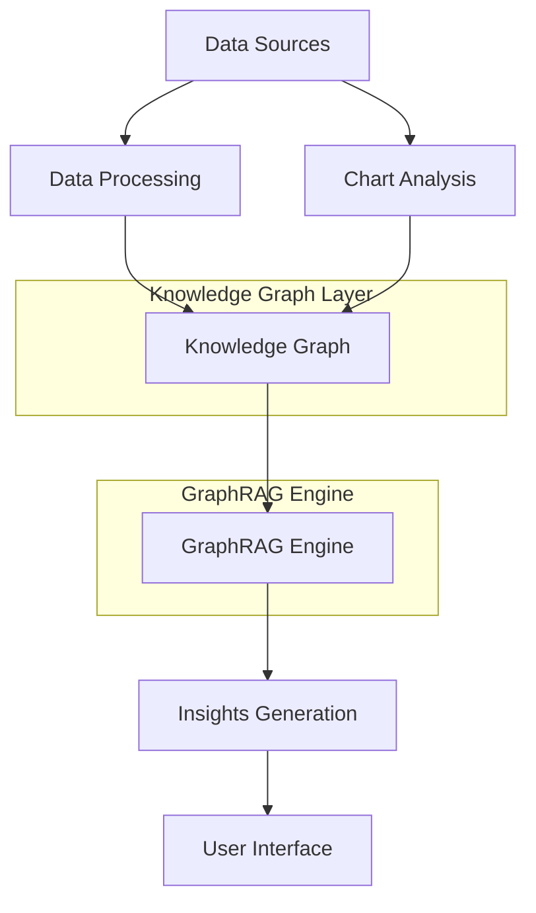

# Architecture

This document describes the architecture of the Chart Insights System, providing an overview of its components and how they interact.

## High-Level Architecture

The Chart Insights System architecture consists of several key components that work together to analyze charts and generate insights:

## Components

### Chart Analysis

The Chart Analysis component is responsible for processing chart data, whether from raw data sources or chart images. It:

- Extracts data from chart images using computer vision
- Processes raw data to understand chart structure
- Identifies chart type and metadata
- Prepares data for knowledge graph construction

**Key Classes**:
- `ChartAnalyzer`: Coordinates chart recognition and data extraction
- `BarChartExtractor`, `LineChartExtractor`, etc.: Specialized extractors for different chart types
- `ChartVisualizer`: Creates visualizations of analyzed charts

### Knowledge Graph

The Knowledge Graph component builds a graph representation of chart data, where:

- Nodes represent entities (chart, categories, data points, statistics)
- Edges represent relationships between entities
- Properties capture metadata and values

This graph structure enables sophisticated analysis beyond what's possible with tabular data.

**Key Classes**:
- `ChartKnowledgeGraphBuilder`: Constructs knowledge graphs from chart data
- `Neo4jConnector`: Handles persistence of graphs in Neo4j
- `MemoryGraphConnector`: Provides in-memory fallback for graph storage

### GraphRAG Engine

The GraphRAG (Graph-based Retrieval Augmented Generation) engine:

- Traverses the knowledge graph to find relevant context
- Generates queries to extract patterns and insights
- Prepares context for the LLM
- Processes LLM responses into structured insights

**Key Classes**:
- `ChartGraphRAG`: Coordinates the GraphRAG process
- `GraphTraversalEngine`: Handles graph exploration and pattern detection
- `CypherQueryGenerator`: Creates database queries for insight extraction
- `PromptBuilder`: Constructs prompts for the LLM

### Insights Generation

The Insights Generation component:

- Coordinates the end-to-end insight generation process
- Formats insights for display
- Handles different insight types (trend, comparison, anomaly, correlation)
- Manages insight quality and confidence scoring

**Key Classes**:
- `InsightGenerator`: Coordinates the insight generation process
- `InsightFormatter`: Formats insights for display

### User Interface

The User Interface component provides:

- An interactive Streamlit application for chart analysis
- Visualization of knowledge graphs
- Display of generated insights
- Configuration options for the analysis process

**Key Files**:
- `streamlit_app.py`: Implements the Streamlit UI

## Data Flow

1. **Input Stage**:
   - User provides chart data (CSV, Excel) or chart image
   - Chart type and metadata are specified or detected

2. **Analysis Stage**:
   - Chart data is extracted and processed
   - Knowledge graph is constructed
   - Graph is stored in Neo4j (or in-memory fallback)

3. **Insight Generation Stage**:
   - GraphRAG engine explores the knowledge graph
   - Context is prepared for the LLM
   - LLM generates insights
   - Insights are processed and scored

4. **Output Stage**:
   - Insights are formatted and categorized
   - Results are displayed in the UI or saved to a file

## Technology Stack

- **Programming Language**: Python 3.10+
- **Graph Database**: Neo4j 5.x
- **LLM Integration**: OpenAI GPT-4/Claude
- **Data Processing**: Pandas, NumPy, Matplotlib
- **Graph Processing**: NetworkX
- **Computer Vision**: OpenCV, PyTesseract
- **Web UI**: Streamlit

## Extensibility

The Chart Insights System is designed to be extensible:

- New chart types can be added by implementing new extractors
- New insight types can be added in the `InsightGenerator`
- Alternative LLM providers can be integrated through the modular design
- Custom graph database backends can be implemented by extending the connector classes

For more detailed information on specific components, see:

- [Knowledge Graph](knowledge-graph.md)
- [GraphRAG](graphrag.md)
- [Neo4j Integration](neo4j-integration.md)
