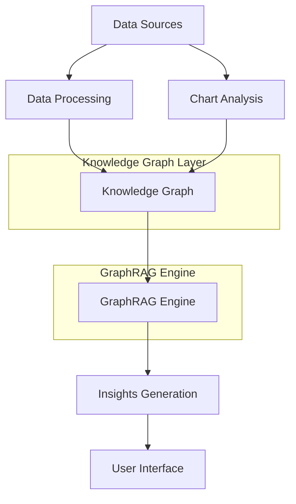

# Chart Insights System

{ align=right width=300 }

**Automated Chart Insights Generation with Knowledge Graphs and GraphRAG**

The Chart Insights System is an advanced analytics tool that automatically generates meaningful insights from chart data. It uses knowledge graphs and graph-based retrieval augmented generation (GraphRAG) to understand charts and extract insights that might not be immediately obvious.

## Features

- **Chart Analysis**: Extract data from chart images using computer vision or process raw data directly
- **Knowledge Graph Creation**: Build rich knowledge graphs representing chart entities and relationships
- **GraphRAG**: Use graph-based retrieval augmented generation to create contextual insights
- **Insight Generation**: Automatically generate trend, comparison, anomaly, and correlation insights
- **User Interface**: Interactive Streamlit UI for easy visualization and exploration

## Getting Started

```bash
# Clone the repository
git clone https://github.com/yourusername/chart_insights_system.git
cd chart_insights_system

# Set up a virtual environment
python -m venv venv
source venv/bin/activate  # On Windows, use: venv\Scripts\activate

# Install dependencies
pip install -r requirements.txt

# Run the Streamlit UI
python main.py --ui
```

For detailed installation instructions, see the [Installation Guide](user/installation.md).

## Example Usage

Analyze data from a CSV file:
```
python main.py --data data/samples/sales_data.csv --chart-type line
```

Analyze a chart image:
```
python main.py --image path/to/chart.png
```

Generate specific insight types:
```
python main.py --data data/samples/sales_data.csv --chart-type line --insight-types trend anomaly
```

## Insight Types

The system generates four types of insights:

1. **Trend Insights**: Patterns of change over time
2. **Comparison Insights**: Relationships between different data points
3. **Anomaly Insights**: Unusual or unexpected data points
4. **Correlation Insights**: Relationships between different variables

For more information, see the [Insight Types Guide](user/insight-types.md).

## Architecture

The system implements a sophisticated knowledge graph-based architecture that combines the power of traditional data visualization with advanced graph-based retrieval augmented generation:



For detailed architecture information, see the [Architecture Guide](dev/architecture.md).

## Contributing

Contributions are welcome! Please see our [Contributing Guide](../CONTRIBUTING.md) for details on how to get started.

## License

This project is licensed under the MIT License - see the [LICENSE](../LICENSE.md) file for details.

## Roadmap

See the [Roadmap](ROADMAP.md) for information on planned features and improvements.
